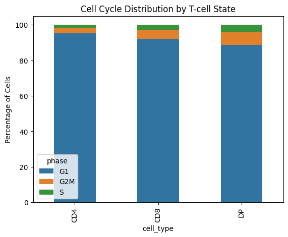
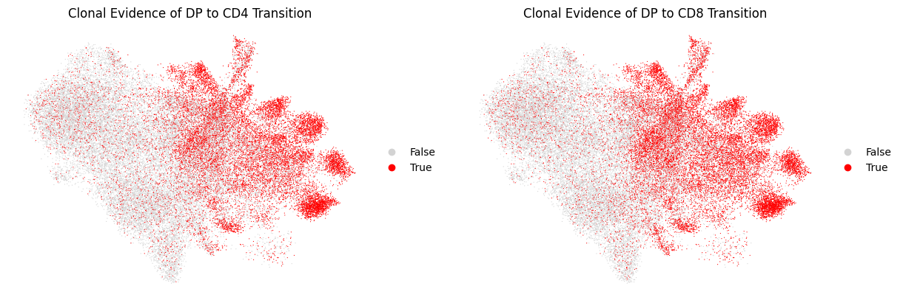
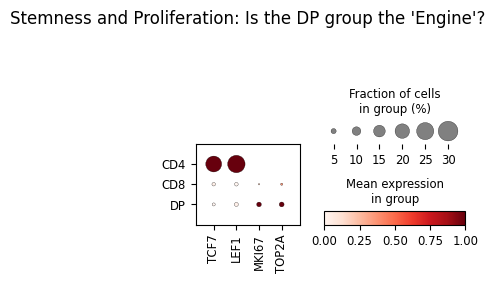
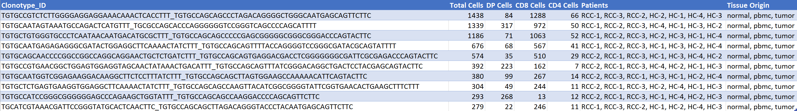
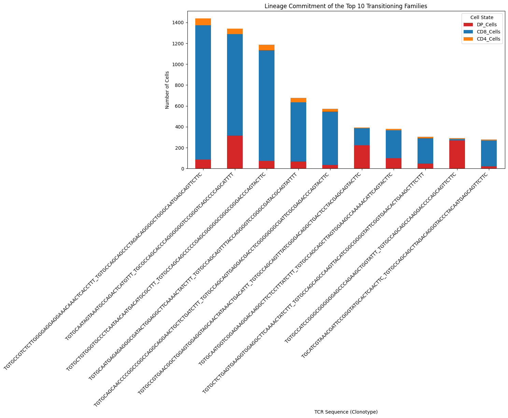
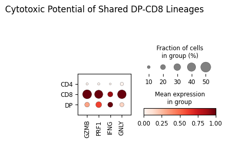
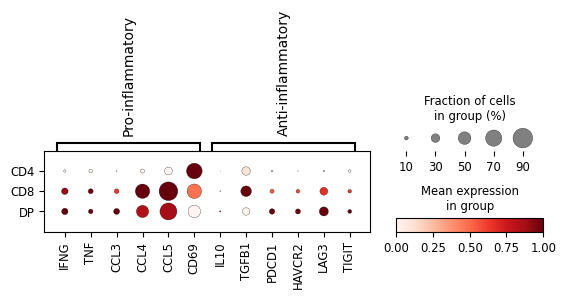

# RCC-immuno-genomics
Study of DP T cells in Renal cancer, data taken from [1]
This multi omics project in the field of cancer genomics immunology studied the behavior of DP T cells in Renal cell carcinoma. 

# Addressing the issues
In order to successfuly map the DP Progenitor engine of the Tumor Immune Response, following issues had to be addressed

**(1). The Double Positive (DP) population found in tumor cells of Renal Cell Carcinoma (RCC)**

A small population of T-cells expressing both CD4 and CD8 markers (Double Positive, or DP) was identified. DP cells found in tumor tissue could represent a functional source of new immune cells, triggered by the tumor environment.

**(2). Multi-Omic Integration**

To address these issues, distinct layers of single-cell data from had to be integrated: 
 - Transcriptomics data (scRNA-seq) was used to identify cell populations 
 - TCR Sequencing data (scTCR-seq) was used to track families (clonotypes) across different states
 - Cell Cycle Scoring was used to identify which cells were actively dividing.

**(3) Functional analysis (Evidence)**

Following functionality of the cell lineages was assesed:
 - The Genetic Fingerprint (Clonal Sharing)  ->  By identifying shared TCR sequences provided proof that cells in the DP cluster shared identical genetic parents with cells in the mature CD8 and CD4 clusters
 - The Expansion Ratio (Source vs. Sink)     ->  Size of these families needed to be quantified. Top clones showed a massive imbalance, where a handful of DP cells (the "Source") were linked to thousands of CD8/CD4 cells (the "Sink")
 - The Metabolic Engine (Proliferation)      ->  Using dot plots of known proliferation markers, the DP cells were found to be the only group in a state of high-velocity division
 - The Lineage Bifurcation (PAGA Trajectory) ->  Using PAGA trajectory analysis, connectivity between clusters was mathematically modelled
 - The Cytotoxic potential (Cytotoxicity)    ->  Using dot plots of known cytotoxicy markers, the CD8 cells show the highest mean expression and largest fraction of cells that exhibit cytotoxic functionality 
 - The (pro vs anti) inflammatory response   ->  Using dot plots of known pro and anti inflamatory markers, the inflamatory potential of cell lineages was assesed.

Using the findings from above points the study concluded that DP cells in RCC represent a progenitor reservoir with following functionality:
 - Recognize tumor antigens
 - Amplify the response through rapid division
 - Refill the army of effector cells that are exhausted or killed by the tumor.

# Processing flow

Complete processing flow is represented by Flow diagram (Figure 1)

**Figure 1: Complete processing flow**

# Processing flow details

## Phase 1 (The Input)

**h5ad object**

I used the original h5ad object from the original project. From the name designation and layers/objects, I concluded that the adata object has already been processed by the authors of the original study as follows:

- filtered out all cells except T cells
- removed doublets (removed cells where two cells were stuck together).
- removed contaminant cells (like dead cells or ambient RNA).
- removed batch effects (using harmony).

Based on transcriptomic profiles (see Figure 5), the remaining cells were classified into one of the T cell classes. 

**TCR object**

I used the original TCR object provided by the authors of the original project. The original reads have been processed by one of the tools for processing scTCR reads and merged. Columns, related to clustering, were transferred from the h5ad object.  

**Merging objects**

Before any operations could be done, following issues needed to be resolved:

 - Barcode mismatch between the inputs (scRNA-seq, scTCR-seq)
 - Creation of unified data object with TCR and single cell data.

### UMAP plots

The different cell lineages are best illustrated by UMAP plots. 

**Figure 2: UMAP plot I (cell type/patient)** 

**Figure 3: UMAP plot II (cell cycle/T cell functional identity)**

**Observation on UMAP plot II**

(1) Plot on the left (cell cycle) shows T-cells that are actively proliferating (G2S, M phase) vs. others (G1 phase) concentrated in the top middle cluster, which coincides with the top middle cluster (marked PROLIF) of the UMAP plot on the right. 

(2) Both plots show cells that are actively proliferating occupying the same cluster on different plots. Cell cycle distribution may also be visualized with stacked bar plot.

**Figure 4: Cell cycle distribution**

## Phase 2 (TCR data) - Identifying shared clonotypes

In order to establish clonal relationship between different cell lineages, shared clonotype category is required. This enables us to view which clonotypes are shared between DP and CD4/CD8 lineages. These relationships are illustrated with UMAP plots.

**Figure 5: Shared clonotypes UMAP plot**

The CD4 Transition plot shows dots concentrated more toward the top and far-left islands, whereas the CD8 Transition (Right) plot shows red dots are much more dense in the lower-right clusters. 

Small, dense cluster in the center-right is intense in both plots. This is the DP progenitor pool is feeding both lineages simultaneously.

## Phase 3 (scRNA data) - Identify dividing cells

In this phase, proliferating cells were identifies using well-known marker genes 

**Figure 6: Proliferation of cell lineages** 

**Observation**

(1) The DP group has the lowest total cell count, it has the highest concentration of actively dividing cells. These cells are in a state of rapid cell cycle (mitosis), creating the seeds that then differentiate and expand into the massive CD8 and CD4 lineages, as seen on Figure 5. 

(2) This proves that the DP population is the Progenitor Engine.

(3) CD4 group shows the highest expression of the classic marker for stem-like memory T-cells . This implies that CD4 cells are acting as the long-term pool, required to maintain presence of these cell lineages in the tumor.

## Phase 4 (Integration) - Detailed Functional analysis

### Clonotypes summary

In this section, the most expanded shared clonotypes found in this assay were identified and quantified. The summary is provided in the Table 1. Lineage commitment of top shared families is provided in Figure 7.

**Table 1: List of Top expanded/shared Clonotypes** 

**Figure 7: Lineage commitment of top shared clonotype families**

**Observations**

(1) Clonal expansion -> Progenitor-to-Effector Ratio on some lineages is significant (e.g. rows 0, 2), which shows considerable Clonal Expansion. 

(2) Public Clones --> Every single one of top 10 clones is found in multiple patients. Usually, TCRs are unique to an individual. Finding the exact same TCR sequence shared across different people suggests these clones are targeting a very common cancer antigen or a "super-antigen" common to Renal Cell Carcinoma.

(3) Tissue Trajectory --> Clones are found in almost all tissues. This proves that these families are not local to kidney. The DP clones likely start in the tumor or kidney tissue and then the expanded CD8/CD4 cells circulate through the blood (PBMC) to monitor the rest of the body.

### Cytotoxic potential

Cytotoxic potential of DP-CD8 shared lineages is related with expression of cytotoxicity genes (GZMB, PRF1, and GNLY) across the shared DP-CD8 lineages (top 3 are selected). The cytotoxic potential is revealed using dotplot (Figure 8)

**Figure 8: Cytotoxic potential of shared cell lineages**

**Observations**

(1) The CD8 cells show the highest mean expression and largest fraction of cells for GZMB, PRF1, and GNLY. This indicates they are the fully mature T killer cells.

(2) The DP cells already show moderate expression of these killing genes (especially GZMB and PRF1). They haven't reached the full intensity of the CD8 state.

(3) The Lineage Split: The CD4 cells in these same families show almost no expression of these cytotoxic markers. This suggests that once a DP cell commits to the CD8 lineage, it activates this specific killing program.

### Inflammatory potential

Balance between pro and anti inflammatory response highlights the biological tension in the tumor and the surrounding tissues. To asses it, I used dot plot on known pro and anti inflammatory markers (see Figure 9).

**Figure 9: Dotplot of pro vs. anti inflammatory markers**

**Observations**

(1) DP cells and CD8 cells (left part of the plot) are predominantly active in pro-inflamatory response. 

(2) Chemokines (IFNG, CCL3, CCL4, CCL5), most expressed in DP and CD8 cells modulate the response of immune system

(3) Anti inflammatory response exhibits immunosuppression, demonstrated by Exhaustion markers (LAG3 and TIGIT), which are significantly higher in DP cells than in the CD4 or CD8 mature populations. This may suggest that these progenitors are already born into a state of high stress. TGF-beta is another potent immunosuppressor; its presence shows that as cells transition from DP to CD8, they are being dialed down by the suppressive signals from the tumor.

# Conclussion

Based on this analysis, following conclussions can be made: 

(1) Evidence of Direct Ancestry -> Identical TCRs were found in DP, CD8, and CD4 clusters. This proves  DP cells are the parents of the mature effector cells 

(2) Evidence of clonal expansion -> Single DP cell could be linked to many (~15-20) mature SP cells

(3) Cell cycle activity (proliferation) -> Highest cell cycle activity was detected in the DP cell population, which are the primary site of T-cell multiplication

(4) Trajectory analysis (PAGA) -> DP cells are the Hub, connecting to all other states

(5) Cytotoxic potential -> DP cells show predominantly signalling potential, while CD8 cells show true cytotoxic potential

(6) Suppressive pressure -> DP cells function as a proliferative engine and a recruitment hub, but they also exhibit early signs of immune checkpoint expression. This indicates that the T-cell response in RCC is under suppressive pressure from the very moment of clonal birth.

References:

[1] Functionally heterogeneous intratumoral CD4+CD8+ double positive T cells can give rise to single positive T cells, PRJNA1389917, 

https://www.ncbi.nlm.nih.gov/geo/query/acc.cgi?acc=GSE314072
