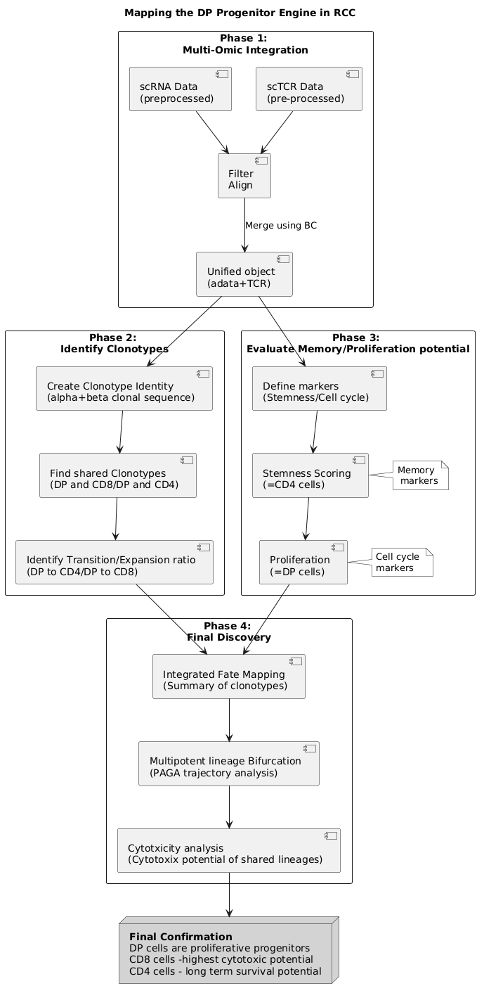
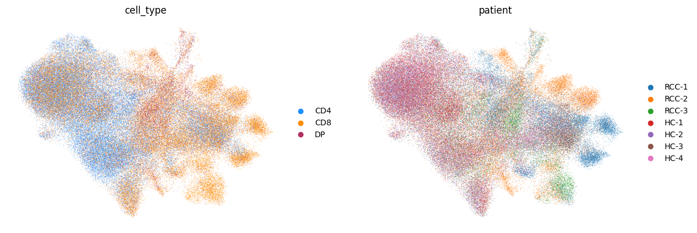
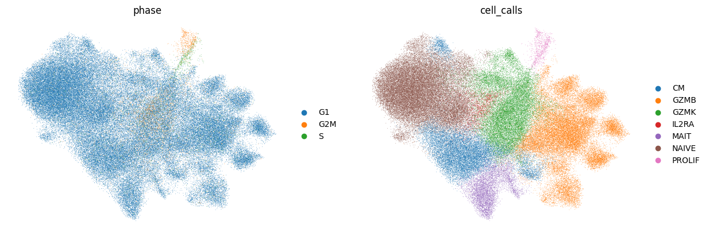

# RCC-immuno-genomincs
Study of DP T cells in Renal cancer, data taken from [1]
This multi omics project in the field of cancer genomics immunology studied the behavior of DP T cells in Renal cell carcinoma. 

# Addressing the issues
To map the Progenitor Engine of the Tumor Immune Response following questions had to be addressed

(1). The Double Positive (DP) population found in tumor cells of Renal Cell Carcinoma (RCC)
Authors of the study identified a small population of T-cells expressing both CD4 and CD8 markers (Double Positive, or DP). DP cells found in tumor tissue could represent a functional source of new immune cells, triggered by the tumor environment.

(2). Multi-Omic Integration
To address these issues, distinct layers of single-cell data from had to be integrated: 
 - Transcriptomics data (scRNA-seq) was used to identify cell populations 
 - TCR Sequencing data (scTCR-seq) was used to track families (clonotypes) across different states
 - Cell Cycle Scoring was used to identify which cells were actively dividing.

(3) The Evidence
To answer these and other related questions, following functionality had to be used
 - The Genetic Fingerprint (Clonal Sharing) -> By identifying shared TCR sequences, we proved that cells in the DP cluster shared identical genetic parents with cells in the mature CD8 and CD4 clusters
 - The Expansion Ratio (Source vs. Sink)  -> Size of these families needed to be quantified. Top clones showed a massive imbalance, where a handful of DP cells (the "Source") were linked to thousands of CD8/CD4 cells (the "Sink")
 - The Metabolic Engine (Proliferation) -> Using dot plots of known proliferation markers, the DP cells were found to be the only group in a state of high-velocity division
 - The Lineage Bifurcation (PAGA Trajectory) -> Using PAGA trajectory analysis, connectivity between clusters was mathematically modelled.

Using the findings from above points the study concluded that DP cells in RCC represent a progenitor reservoir with following functions:
 - Recognize tumor antigens
 - Amplifies the response through rapid division
 - Refills the army of effector cells that are exhausted or killed by the tumor.

# Processing flow
Complete processing flow is represented by Flow diagram (Figure 1)

Figure 1: Complete processing flow

## Comments on processing flow
Phase 1 (The Input)
Before any operations could be done, following issues needed to be resolved:
 - Barcode mismatch between the inputs (scRNA-seq, scTCR-seq)
 - Creation of unified data object with TCR and single cell data
The different cell lineages are best illustrated by UMAP plots. 

Figure 2: UMAP plot I 

Figure 3: UMAP plot II

Phase 2 (TCR data) 
Establish clonal relationship between different cell lineages, and 

Phase 3 (RNA) proved that DP cells were the only ones dividing.
Phase 4 (The Integration): Shows where you brought them together to create the branching UMAPs and the final PAGA trajectory.

Why this is a "Multi-Omic Masterclass"
This diagram is great for a talk because it shows that you didn't just run an algorithm and accept the result. You built your conclusion by integrating:
Genotype (TCR-seq/MiXCR)
Phenotype (RNA-seq/Transcriptome)
Metabolism (Cell Cycle Scoring)

It is a complete, well-reasoned systems immunology project.

References:
[1] Functionally heterogeneous intratumoral CD4+CD8+ double positive T cells can give rise to single positive T cells, PRJNA1389917, https://www.ncbi.nlm.nih.gov/geo/query/acc.cgi?acc=GSE314072
